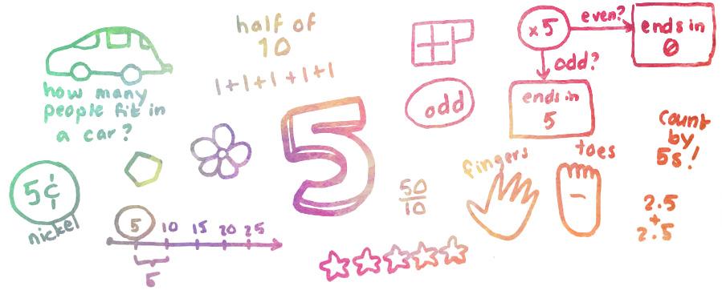

Education is really important. Education is the reason you are where you are today. Education is probably also the reason why you're not where you want to be. Education is about hard work, about grit, about perseverance. But education is also about privilege. The privilege of being born into a family that supports your education. The privilege of going to a good school. The privilege of being surrounded by positive attitudes towards learning. A huge part of why I'm dedicating my life to education is that I want to do what I can to level the playing field.

By day, I'm already on the education train. I managed to land a job at [Khan Academy](https://khanacademy.org), an organization with the goal to create a free world-class education for anyone anywhere. Leveraging this team of 80 people, our connections, and our combined talents greatly increases the impact I can have. This is an amazing opportunity to do good. But by night I want to do even more good. So where do people need help?

One of the pain points I've been obsessing over for a few years is **basic number sense**. Being comfortable with number manipulations means that you can focus on the higher order concepts without constantly stumbling over manipulating digits.

## What is number sense?

Number sense is being comfortable with numbers. You see a number and have an immediate reaction to how big that number is. You can estimate the result of operations on any number, such as adding to it, multiplying it, squaring it, etc. You can round the number based on any criteria. You can order numbers by size. You have a gut feeling for whether a number makes sense as the answer to word problem.

Obviously the scale of this comfort varies greatly for different number sets. Being comfortable will whole numbers less than 10, or less than 100, or common fractions, is a different story than being able to say you are comfortable with numbers in the range of `2.2034832E64` or `33/567`. But this ability scales very nicely!

## Number sense is fundamental to math

I argue that number sense is as fundamental to math as the ability to sight-read is to literacy. Imagine reading a novel and having to sound out each word. You'd be able to brute force through short sentences and words, like "The dog is red!" but how would you even begin to wrap your mind around the prose of a biology textbook? Shakespeare's plays? The Great Gatsby? At some point you'd pass from being able to make it through a sentence, to hitting a wall. The sentence just would be lost in a sea of letters, and the higher level concepts wouldn't even cross your mind. Suddenly it would be just too hard, and that would be it. You'd say, "this is all above my head!" and you'd walk away.

This happens so often with math.

I bet that while reading through this post not once did you stop to sound out a word or remark at its spelling – you simply digested the content as you read it, as it passed through an invisible filter that you built when you were young sounding out big words and stumbling through sentences.

If you take in numbers on a page as a series of glyphs that have no weight, no feeling, and no connections to each other or to other parts of your life, then an equation is a cryptic mess. Lack of number sense makes you trip over every *carry the two* or *bring the 4 to the left side of the equation*. You won't see the forest through the trees.

## What can we do about it?

I want to find a way to teach number sense and numeracy in a way that makes reading equations as effortless as sight-reading the words on this page. I want to also make it available to as many people as possible, so I need a distribution method that is scalable and doesn't require paying for a private tutor.

This isn't going to be easy.

I'm thinking I'll start with something fundamental that Khan Academy doesn't cover yet: multiplication tables. Sure we have all the exercises, but they're not set up in a way that checks if you have all the answers memorized, and there isn't a way to check progress for each product individually (e.g. 7×8 is very different from 2×2).

Tackling addition of 1-digit numbers falls right in line with this, since it mirrors multiplication so nicely and it a very helpful prerequisite. After mastering the basics we can tackle their inverses (subtraction and division) and mixed operations. Any teacher will tell you that division gets much easier when you know your multiplication tables, and order of operations comes easily once you understand the constituent parts.

The plan for now is to build an app (web? mobile? web-mobile?) that will help learners get to the point where their basic **Math Facts** – addition and multiplication – are automatic. How do we do that? What is the best way to teach this? Is this something worth teaching? I don't know. I'll start by building something, putting it in front of people, and seeing where that leads. Hopefully I'll find out that I'm wrong a lot, and that will give me lots of feedback on where to iterate.

> "You should take the approach that you’re wrong. Your goal is to be less wrong." — [Elon Musk](https://www.youtube.com/watch?v=Q8Y565OnarQ)

Time to start being wrong a lot.

------

**Author's note:** This post was written retroactively in November 2015 to explain how this whole "Math Facts" process turned out. It's a series!
