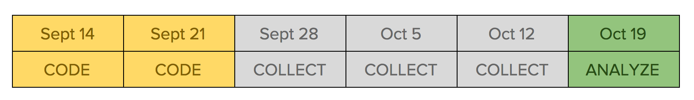
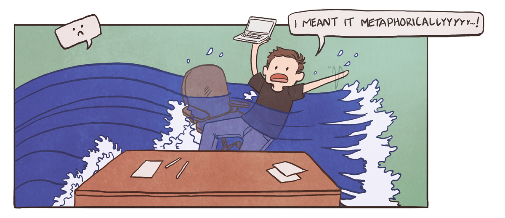

At this point I've made an app that lets you practice your math facts, but there are some major questions left unanswered. Does it actually help people learn or remember their math facts? Do people enjoy using it? To get answers to those questions we need data. We need people to use the app so we can see if they make progress and if they continue to use it without me hovering over them.

## The proposal

We agreed in the [follow-up conversation](/posts/math-facts-part-4) that a two-week project to set up data collection is a good idea. In order to collect data, we need to, y'know, store the data somewhere and have people to collect it from. I knew it would be tight to fit this project into our already-packed calendar for the year, so I distilled it down to what I hoped was the bare minimum we needed:

1. Set up the app so that it sends data back to a central location.
2. Set the app up in a way that lets us easily distribute it to people for alpha testing.
3. Convince a group of people to commit to using the app each day.
4. Fix the bare-minimum bugs like the keyboard being laggy.
5. Try adding push notifications or some sort of daily reminder or incentive.

I proposed that I could do this project in a two week gap between when my current project ended and my next project started. Since my next project is a 5-month many-person project to implement the redesign of Khan Academy's content library, I would have to wait until March if we deferred it.

*")

## The verdict

A few days after proposing the follow-up project, Monica told me that they needed to defer it so I could work on a more urgent fix for our teacher dashboard.

In that moment I was overcome with a wave of disappointment.

Now what?

Without this project, I wouldn't have a way to collect data from people using the app. I also wouldn't have a way to get it to them, and wouldn't have people who would use it. I knew that the only way to make progress was to get it in the hands of people so that I could get feedback.

Dealing with this deferral wasn't easy. Waiting five months would feel like forever, and this project was really important to me.

And then I realized something. This project *is* important to me. Not past-tense. Present.

So I decided to carve out time from my evenings and weekends to work on it. A full work schedule wasn't going to keep me from making progress. I would just make it happen.

## The evening and weekend project

I ended up dedicating 11 hours to a Math Facts marathon on a Saturday in late September to get the data storage set up. Actually collecting the data turned out to be an easy problem to solve once I rewrote the datastore logic: [Firebase](https://www.firebase.com/) offers free database hosting that you can access with two lines of JavaScript, and once I had that I could build a dashboard for myself to watch everyone's data come in.

, this only took about an hour to set up and allowed people to click on each fact to see the time breakdowns. React Native is pretty cool.")

That gave me enough progress to start visiting the school downstairs every weekday. I let them use my phone to play it, so I could skip the hairy task of setting up a version they could download. Three weeks of daily visits gave me a lot of immediate feedback and set me up to have the data I'd need to see how they progressed over time.

As time went on, I set aside more time to work on the Math Facts app. Eventually it got to a point where I made it a [part of my daily routine](../post/time-tracking-experiment-nov-2015). In November I started talking to the Project Pipeline Masters again about doing a follow-up project. Although everyone was still excited about the progress I was making and wanted me to work more on it, the resolution remained that I needed to finish the Content Library Redesign initiative before we'd have space in the schedule for a Math Facts project.

Even though it isn't officially scheduled, every morning and weekend I make a little more progress towards shipping the Math Facts app. The story continues! Stay tuned for more rambling.