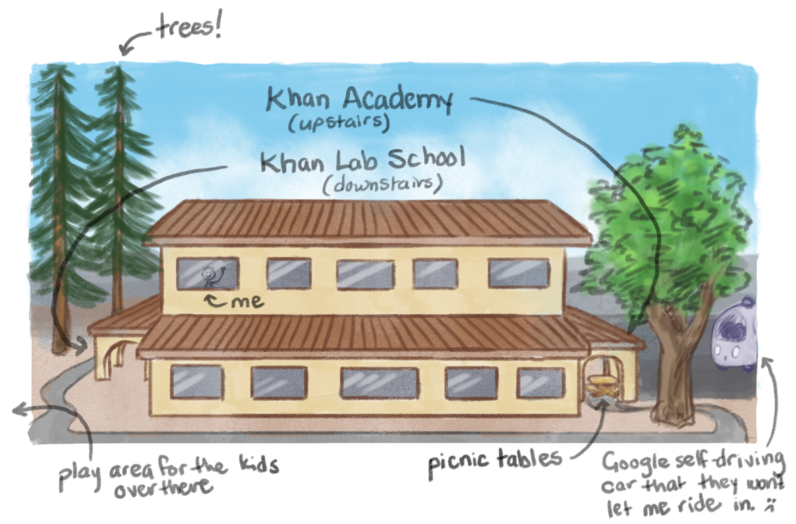

There's this philosophy around building products called the [Lean Startup method](https://en.wikipedia.org/wiki/Lean_startup), which encourages you to heavily seek feedback from real users early and often. It sounds simple – just talk to people and you'll be successful – but getting feedback is tough in many ways.

To start with, you have to find people to give you feedback. They need to be the kind of people that have a real need for the product your building. You also need to spend a lot of time sorting through confusing and vague feedback to figure out what they're really saying.

A few years ago – before I worked at Khan Academy – I was convinced that I could build my own educational website that would change education. In two months I built a [product](http://thinkellie.com/academy) that a few hundred people found valuable and learned a lot about what it takes to make a product successful. Spoiler: you need to solve a real pain point, and you need to actually solve it. A good start to doing that is to *actually talk to the people who will use your product*.

For the Math Facts app, those people need help memorizing their multiplication tables. And they're probably kids. Conveniently, my desk is about a 2 minute walk from a school.

## Khan Lab School (KLS)

Last September, a school called Khan Lab School (KLS) opened on the first floor of our office building. For the 2014 school year they piloted the program with 30 students aged 5-13, and in September 2015 they expanded to 60 students. These kids are really great at giving candid feedback about things we're building at KA, and helped a lot with testing the Math Facts app.

The teachers encourage KA employees to come visit the school and help out by mentoring, answering questions, and talking to the kids about what we're working on. A few of us do this pretty regularly, and talk to the kids about the new content and changes to the website that we're making upstairs.

During the [initial Math Facts project](../post/math-facts-part-3) I would visit the lab school a couple times a week to show the kids the app.

Since I didn't have much of a product at this stage, taking in the feedback was a really interesting challenge. I had to stay very focused on the underlying goal of the app: to help kids get better number sense. My current hypothesis is still that memorizing multiplication tables is a popular first step, and from there we can branch out into other areas of basic math.

A lot of the feedback I got at this stage was freeform and unguided. The kids saw that I was making an app, and gave me the most helpful feedback they could come up with: make it more fun, like [crossy road](http://www.crossyroad.com/). These kids know what sells.

After the initial project I went a few months without consistent interaction with the school. Eventually I carved out enough time to [work consistently on the app](../post/math-facts-part-5), and started going to KLS every day for a few weeks.

During this time the app was at a point where the feedback that was given or that I observed was deeper and more relevant to the decisions I was trying to make about the app.

## Some examples of feedback

Almost all of the relevant feedback I got about the app I learned by observing the kids interact with it, and by deciphering their questions, suggestions, and reactions to find out what the underlying issues were.

, where you had to do 10 questions to continue, and the new quiz format (right), where you have 60 seconds to answer as many questions as you can." 400)

For example, one of the first major hurdles that I ran into was that the kids didn't realize that they should try to answer the questions quickly. They saw "do 10 questions" and took all the time in the world. They started a game, and then talked to me about their dog, or said hi to their friend, or started drawing a picture of their app idea.

The time data was the essence of what would make the app be able to teach them, so I iterated pretty quickly to have it be a timer that ticks down while you do as many as you can. Now they felt the urgency to answer questions quickly, and also found the game more fun because they knew that going faster would mean getting a better score.

, and the new progress screen design (right). This is a screen that I'm still iterating heavily on, since it still isn't immediately clear what this grid of numbers is meant to convey." 400)

I also ran into some trouble with the progress screen in the app. Younger kids don't understand what the grid of numbers is supposed to be. They would go to their progress page and ask me if this was a page with all the answers – which it is! It's just supposed to show more information than that, and give you feedback on which facts you know well and which you need to keep practicing.

There are lots of examples of things that I learned over the many sessions I had with the kids. Probably more than I could list here, and there are plenty that I wouldn't even remember because these many interactions continuously changed my point of view in a subtle way.

## Higher level benefits of continuous feedback

Beyond the immediate feedback of fixing bugs and sorting through product details, talking to students regularly gave me a lot of inspiration to keep going. Some days I would feel like I hadn't made any progress, and would feel motivated again when I saw how this would help them.

There were a couple days where I would bring one of my coworkers with me to watch the testing sessions. I warned them that when we entered a room, 5 children would throw their hands in the air and rattle off "I'm first!", "Second!", "Third!", "Fourth!", "Fifth!", and without fail the kids would do it. They were really excited to see me and to help give feedback.

Talking to them also gave me a lot of empathy for what they were going through. I knew that learning your multiplication tables is hard, but it isn't something that I have to deal every day. They do.

Over those weeks, I built a connection with the kids that grew over time. On one hand, it's important to gather feedback from a diverse set of testers. On the other hand, it's valuable to forge deep, meaningful connections with some of the people using your product. You get to learn a lot more about how they feel about math in general, what other kinds of things they like, and their motivations in many parts of their lives. It's a balance.

At the end of the day, the people using your app aren't just users. They're people. They're multi-dimensional, intricate, and deep. And they're probably pretty cool. So go talk to them!

My next step is to find a more diverse group to get feedback from, and to remember to never stop seeking it.
