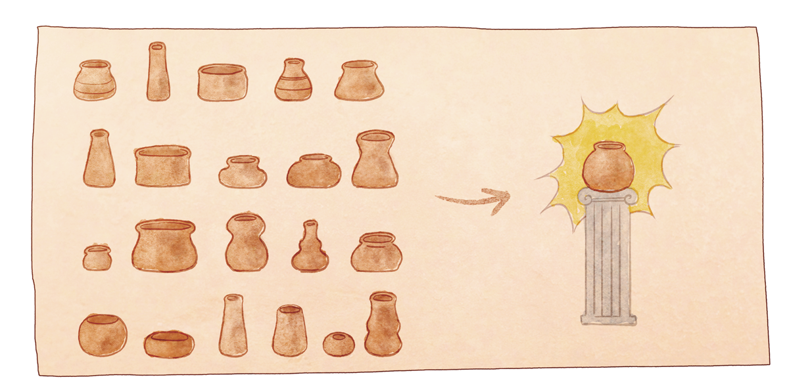

This blog is just thoughts as they come spilling out of my mind. I intentionally only read them over a few times. I'm not expecting that they are going to be any good. But I am expecting them to get better.

And yes, I'm now blogging about blogging.

There's a [story about pots](https://sivers.org/qlq) that inspired this mindset. The story goes that a ceramics teacher divides their class into two factions: one half will spend the semester making the most beautiful pot they can, and the other half will make as many pots as they can.

The result was that the highest quality pots were made by the group tasked with making many pots, not a perfect one.

When I've tried to blog before it was always under a blanket of pressure. Pressure to be interesting, funny, smart, and *original*. I've since learned that being original is a myth. I've also learned that practice makes you get better at things.

One of the biggest things I need to work on is bragging more about my work. Even just telling people about it would be a good first step. I spend so much of my time trying to help people around me that I forget to point out that I'm doing things at all.

This blog probably isn't going to contain much bragging. At the very least though, I can use it to *tell* people about my work. I can get on board with that. It took a lot of self-convincing to get me to start doing this, but look! I wrote some blog posts.