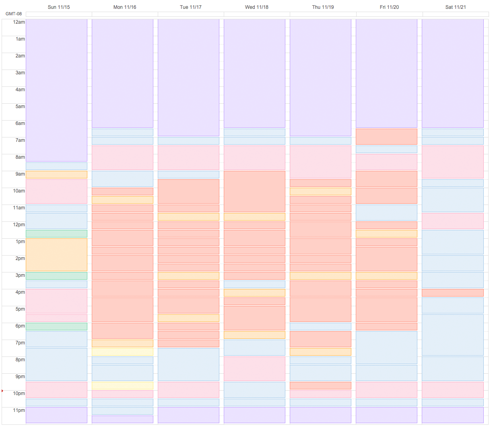

Last week I tried an experiment. It's a bit of a weird experiment. As a baseline for my weirdness score in general: I use Google calendar to keep track of everything that I do. Yeah. Anyway, I've been doing it since April and it's amazing. The experiment I did last week built up on this already weird premise – at the beginning of last week I scheduled my entire week in advance and then tried to live by it.

For context, here's what a pretty good week looks like:

![This is a screenshot of Google calendar. This is really hard to describe well in a few lines of text. Basically, it's my whole week (24 hours a day for 7 days) with each hour categorized with the way I spent that time. For example, most days I sleep for about 8 hours from 11pm to 7am. I also work for a bunch of time in the middle of the day, and do not work-things at night. I could probably make this description much better. I'm sorry. You know what? You seem really nice. If you send me a GitHub issue then I will work with you to figure out a way to make these descriptions useful.](../images/time-tracking-example.png "Time-tracking for the week of November 1st. This was the week that all the remote folks from my team at work were in town, so we did lots of fun team events (yellow).")

I removed the titles of each time block because I write silly things there, but you can get the gist of what each color means by using this handy list of which color goes with each calendar:

Looking at the time tracking for this week tells you a few things:

1. **Mornings:** The times I got out of bed each day were fairly consistent (6:30-7:30am). Some weeks I'll have days where I get up as late as 9am, but this week was pretty good.
2. **Work:** Even though I got up around the same time, the time I started work varied wildly (7:00-10:30am). I also work on the weekend a lot because I feel like I don't get enough quiet time during the week.
3. **Lost time:** I lost a lot of time to the "other" category (blue) in the mornings. Most of that was caused by not really having a clear plan of what I would do when I woke up, so I would just roll over and stay in my blanket fort for a while.
4.  **Sleep:** The amount of sleep I was getting wasn't nearly consistent enough, and meant that some days I would wake up groggy and feel sluggish for the rest of the day.
5. **Side projects:** The amount of time I spent on side projects was really erratic, and heavily biased towards the end of the week. I'd much rather be in a consistent schedule than do the weekend-crunch and burn myself out.

In general I wasn't really happy with how my weeks were turning out. I felt like I was spending a lot of time working, but very little time getting into the flow of coding. I also felt like I had no consistent time to work on [Math Facts](github.com/Khan/math-facts) or to write silly blog posts, and was usually staring at a screen up until the moment I went to bed.

"So!" I said to myself, "what do I *want* my calendar to look like at the end of the week?" And thus, I built this monstrosity:

![This is a screenshot of Google calendar. For this week I filled out my hours in advance, and said I would sleep from 11-7, shower until 7:30, work on math facts until 9am, write code for work until 11, then I would walk to work, then I would have meetings and lost time until 3pm, then I would do a workout with my coworkers, then I would write more code until 6:30pm, then I would walk home, then I left a gap for dinner, then I would blog from 9:30 to 10:30pm, then I would read for a half an hour, and then I would sleep.](../images/time-tracking-plan-nov-2015.png "This is the week of November 15th planned out in advance.")

I planned out most of my week in advance and told myself I would stick to it as much as possible. Here's some more information if you want, but feel free to skip over it if you're having a panic attack about the amount of self-micro-managing going on right now:

1. **Mornings:** I wanted to [get up at the same time every day](https://www.google.com/search?q=get+up+at+the+same+time+every+day). I notice a drastic difference when I'm in a proper habit and sleep cycle, and it makes a world of a difference.
2. **Work:** I considered most of the time in the middle of the work day just lost time, and instead carved out large chunks for writing code on either side of it. Things like writing emails or docs, doing code reviews, or working on other work things could fill in the gaps. I've really felt like I don't get enough time to actually write code, so this would hopefully help with that.
3. **Lost time:** This mostly means scheduling consistent and well-defined tasks during the high-risk time. Having a half hour of no-screen time before bed is important and solves that, and scheduling a set shower/eat/flop-around half hour in the morning also satisfied my need for useless time.
4. **Sleep:** I do really well on 7.5 hours of sleep (that's five 90-minute sleep cycles), and this schedule would force me to stick to that.
5. **Side projects:** I didn't want to have to carve out [time for side projects](http://ejohn.org/blog/write-code-every-day/) on the spot. This put an intense amount of pressure on me to keep convincing myself that they are worth the time. It's really hard to do that at 6:30am, or in the evening when you just want to crash for the night.

One week later and here are the results!

As you can see, I succeeded in a lot of these. Notably, I woke up at the right time (except Saturday), went to bed at the right time, read a book for 30 minutes before bed, blogged every day, and averaged 1.5 hours per morning working on Math Facts.

What you can't see is that the amount of time I spent coding at work varied wildly. Some days I would get distracted before work, or I'd end up reading docs and emails, or reviewing someone else's code in the morning. My next challenge is to figure out how to more solidly carve out coding time and plan around interrupts.

The rest of the schedule made my life significantly better. I highly recommend it, and will keep iterating on this lovely madness. :)